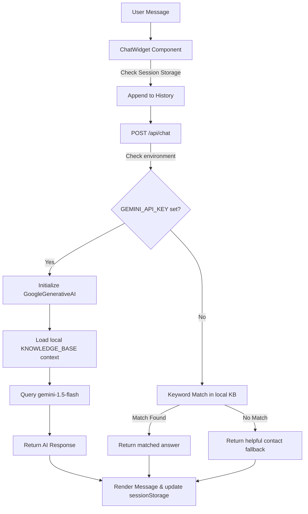

# AD TECH AI Chatbot Integration & Knowledge Assistant

This repository contains the official AI Chatbot Integration and Knowledge Assistant for **AD Tech Enterprises Pvt. Ltd.**

The project is built as a production-ready MVP using **Next.js (App Router)**, **React**, and **Tailwind CSS v4**, and is integrated directly with the **Gemini API** for generative responses, with an intelligent local rule-based system that activates if no API key is present.

---

## 🛠️ Technology Stack
- **Frontend**: React 19, Next.js 15 (App Router), Tailwind CSS v4, Lucide React (for premium icons).
- **Backend/API Routing**: Next.js Serverless Route Handlers (Node.js/TypeScript environment).
- **AI Engine**: `@google/generative-ai` SDK (`gemini-1.5-flash` model).

---

## 🏗️ Project Architecture & Components

The application is modularized as follows:

```
Our-Website/
├── src/
│   ├── app/
│   │   ├── api/
│   │   │   └── chat/
│   │   │       └── route.ts       # Backend chat handler & Gemini execution
│   │   ├── globals.css            # Global CSS, theme mapping, custom animations
│   │   ├── layout.tsx             # Root template & font definitions
│   │   └── page.tsx               # Mock Landing Page hosting the floating widget
│   ├── components/
│   │   └── ChatWidget.tsx         # Floating chatbot widget, forms, theme toggles
│   └── data/
│       └── knowledgeBase.ts       # Structured company knowledge & facts
├── package.json                   # Node modules & build tasks configuration
└── tsconfig.json                  # TypeScript compiler settings
```

---

## 🤖 AI Flow and System Design

### 1. Conversation & Context Flow


### 2. Prompt Structure (System Instructions)
When `GEMINI_API_KEY` is provided, the API handler builds a system instruction that forces the LLM to restrict its answers to the AD TECH knowledge base:
- **Scope Restriction**: The assistant is strictly ordered to only answer questions based on the local knowledge base structure.
- **Tone & Conciseness**: The assistant is guided to output clear, professional, and brief answers (typically 1 to 3 sentences).
- **Graceful Fallbacks**: If the question is outside the knowledge base context, it returns a friendly fallback suggesting that the user email `hradtechenterpriseschepvtltd@gmail.com` or call `+91 83193 58568`.

---

## 💼 Core Features & Quick Actions

1. **Floating Widget**: Clean, sliding interface positioned at the bottom right that expands/collapses smoothly.
2. **Interactive Quick Actions**:
   - **Our Services**: Scrolls user to the services section of the page and returns details on web dev, backend databases, and AI.
   - **Apply for Internship**: Scrolls to Careers, provides the HR application email and list of open developer slots.
   - **Book a Callback**: Opens a dynamic form directly inside the chat window for capturing user names, phone numbers, and emails.
   - **Submit Requirements**: Opens a business scoping form inside the chat window.
3. **Session Memory**: Messages are saved in `sessionStorage` so history is kept as long as the browser tab is open.
4. **Bouncing Typing Indicators**: Displays feedback while waiting for API responses.
5. **Theme Switching**: Includes a dark/light mode toggle inside the widget header.

---

## 🚀 How to Run and Set Up

### 1. Clone & Install Dependencies
Ensure you have [Node.js](https://nodejs.org/) installed, then run:
```bash
npm install
```

### 2. Environment Variables Setup
Create a `.env.local` file in the root of the project to add your Gemini API Key:
```env
GEMINI_API_KEY=your_gemini_api_key_here
```
*Note: If no `.env.local` or API key is set, the chatbot will seamlessly run in local matching mode, meaning you can test it completely without an internet/API connection!*

### 3. Start the Development Server
```bash
npm run dev
```
Open [http://localhost:3000](http://localhost:3000) in your browser to test.

---

## 🔮 Future Improvements
- **Vector Search Database (RAG)**: Connect the backend to a vector database (e.g., Pinecone or ChromaDB) to support massive documents and FAQs dynamically.
- **Callback DB Integration**: Save submitted callback details directly into a SQL or MongoDB database.
- **Email/Slack Alerts**: Automatically send email notifications to HR or developers when a user submits requirements or requests a callback.
- **Authentication**: Keep chat history saved across user logins rather than just browser sessions.
